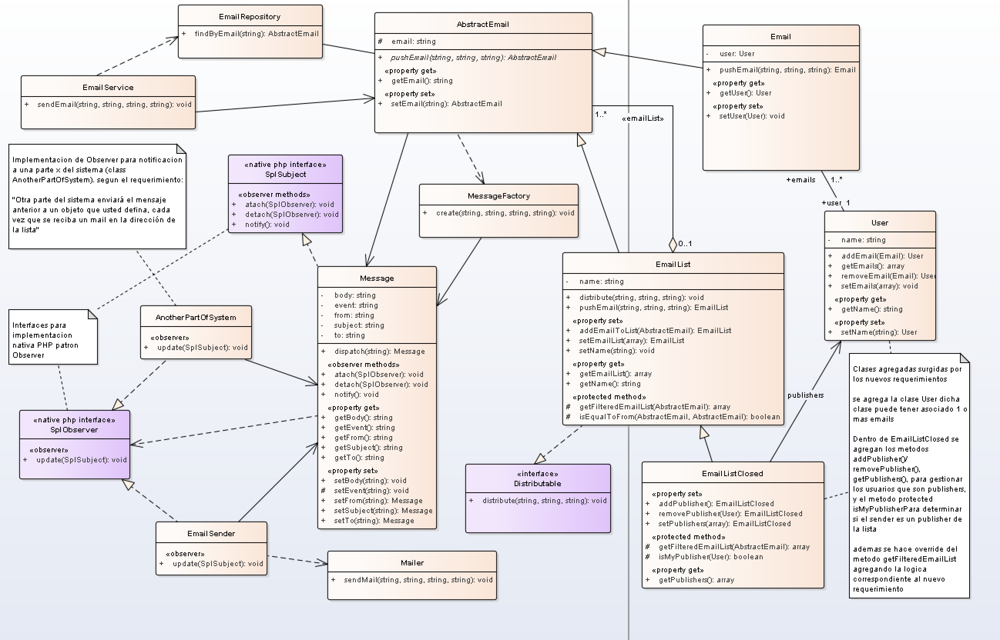
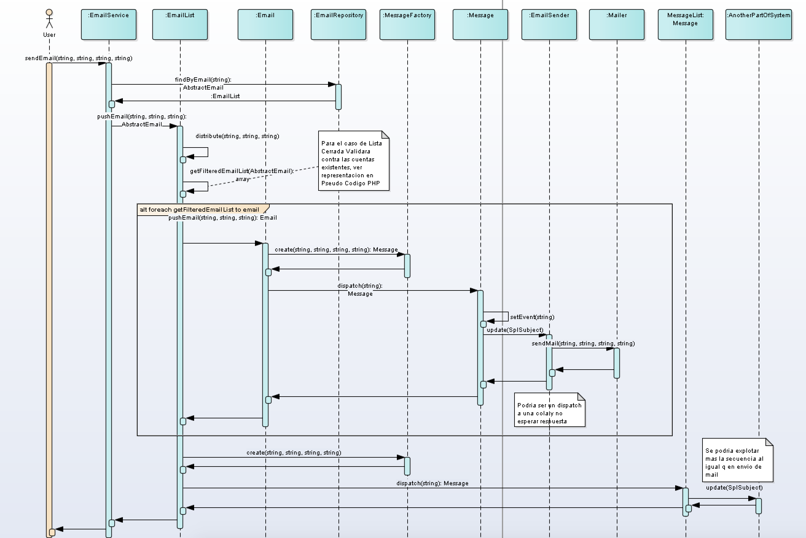

# Ejercicio de Modelado Lista de Emails

## Descripcion

    Para la resolucion del ejercicio se utilizo Enterprise Architect como herramienta de modelado, dentro del directorio doc/ 
    se encuentra el archivo "model.eap" donde se podra visualizar el modelado completo. 
    Para una mayor descripcion de la funcionalidad se implemento la solucion utilizando un Pseudo Codigo PHP (No funcional), 
    en algunos ejemplos de instanciacion de Clases (Factory/Repository/Entidades) se resuelven a modo descriptivo dependiendo 
    del caso se resolveria mediante inyeccion de dependencias del framework XX a utilizar en una implementacion real o una capa de persistencia u ORM.
     
### Modelado de clases

     Dentro del archivo "model.eap" se encontrar el siguiente diagrama de clases, que representa la solucion a la problematica.
     como comentarios en el diagrama se resaltan las clases y metodos agregados para solventar el nuevo requerimiento solicitado en el enunciado.
     ademas se agregan algunos comentarios que describen partes del modelado.
	
    
### Diagrama de secuencias

     El diagrama de secuencias presentado muestra la interaccion entre los objetos, contemplando el caso particular de envio de mail
     a travez de una lista abierta. El diagrama de secuencias fue modelado un nivel medio/alto que permita aclarar el comportamiento
     y sea de ayuda a la hora de trazar el comportamiento en el Pseudo Codigo.
